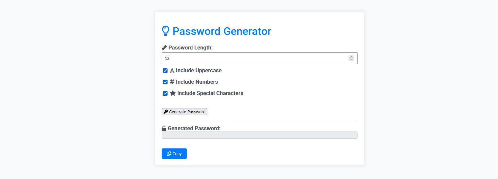

# Password Generator Documentation

## Overview

The Password Generator is a simple web application designed to generate random passwords based on user preferences. It allows users to specify the length of the password and choose whether to include uppercase letters, numbers, and special characters. 🛠️

## Technologies Used

The following technologies were used in the development of this application:

- **HTML:** Used for structuring the content and user interface of the web application. 🌐
- **CSS:** Used for styling and layout of the web pages. 🎨
- **Bootstrap 5:** A popular CSS framework for enhancing the design and responsiveness of the application. 🌈
- **JavaScript:** Used for implementing dynamic behavior, such as generating random passwords and copying them to the clipboard. 🚀
- **jQuery:** A fast and feature-rich JavaScript library used for simplifying DOM manipulation. 📦
- **Font Awesome:** A font and icon toolkit used for adding visually appealing icons to the user interface. 🎉

## Features

1. **Password Length Selection:**
   - Users can specify the desired length of the generated password. 📏

2. **Options for Password Composition:**
   - Users can choose to include uppercase letters, numbers, and special characters in the generated password. ✅

3. **Generate Password Button:**
   - Clicking the "Generate Password" button triggers the generation of a random password based on the user's preferences. 🔄

4. **Copy to Clipboard:**
   - The generated password can be easily copied to the clipboard with the "Copy" button. 📋

## How to Use

1. Open the Password Generator web page in a web browser. 🌐

2. Adjust the password length using the input field. 📏

3. Check or uncheck options for including uppercase letters, numbers, and special characters. ✅

4. Click the "Generate Password" button. 🔄

5. Copy the generated password using the "Copy" button. 📋

## Preview

## Contributions

Contributions are welcome! If you find any issues or have suggestions for improvements, please feel free to open an issue or submit a pull request. 🤝

## License

This project is licensed under the [MIT License](LICENSE). 📄

---
